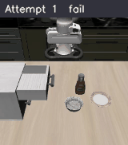

## Robo Auto Simulation
This is an automated robot simulation pipeline. The agent monitors simulation results, analyzes failed episodes, identifies the underlying causes, and continuously updates the VLM instructions to improve future performance. This pipeline is inspired by Andrej Karpathy's vision of automated AI research.

General context is almost similar with Karpathy's original auto research, but changes few parts and adds simulation environment (e.g., LIBERO, etc.).

---
## Demo

Each GIF plays all correction attempts sequentially — vanilla failure first, then VLM corrections adapting toward success. Full playable videos: **[owenk3.github.io/autosimulation](https://owenk3.github.io/autosimulation)**

---
### Run 1 · Bowl on cabinet · ep1585 · `SUCCESS at attempt 8`


---
### Run 2 · Bowl on cabinet · ep1576 · `SUCCESS at attempt 6`
*2 fewer attempts than run 1 — prior corrections transferring*


---
### Run 3 · Bowl on cabinet · ep1576 · `SUCCESS at attempt 5`
*Cross-episode memory transfers proven corrections — fastest convergence*



---
### Run 4 · Bowl stacking · ep840 · `FAILURE — all 10 attempts`

*Stack the black bowl at the front on the black bowl in the middle.*


---

## Quote from Karpathy's autoresearch git repo.

One day, frontier AI research used to be done by meat computers in between eating, sleeping, having other fun, and synchronizing once in a while using sound wave interconnect in the ritual of "group meeting". That era is long gone. Research is now entirely the domain of autonomous swarms of AI agents running across compute cluster megastructures in the skies. The agents claim that we are now in the 10,205th generation of the code base, in any case no one could tell if that's right or wrong as the "code" is now a self-modifying binary that has grown beyond human comprehension. This repo is the story of how it all began. -@karpathy, March 2026.

The idea: give an AI agent a small but real VLM instruction for inference-time VLA correction, and let it experiment autonomously overnight. It modifies VLM instruction (in-context prompting), checks the result for few episodes (for 5 minutes), checks if the result improved, keeps or discards, and repeats. You wake up in the morning to a log of experiments and (hopefully) a better model. The training code here is a simplified implementation of correctVLA. The core idea is that you're not touching any of the Python files like you normally would as a researcher. Instead, you are programming the program.md Markdown files that provide context to the AI agents and set up your autonomous research org.

---
## How it works
The repo is deliberately kept small and only really has three files that matter:
- `prepare.py` — fixed simulation harness. Not modified.
- `train.py` — the single file the agent edits. VLM instructions for in-context learning.
- `program.md` — baseline instructions for the agent. Edited by the human.

By design, training runs for a fixed 5-minute time budget (wall clock, excluding startup/compilation), regardless of the details of your compute. The metric is `success_rate` — higher is better. Success criteria comes from LIBERO result, but sometimes LIBERO results are not correct. If success from LIBERO result, that will be 100% sure, but if failure from LIBERO, you must evaluate by yourself again by analyzing video, and use your own decision compared to language instructions.


---
## Quick Start
Requirements: A single NVIDIA GPU (tested on NVIDIA GeForce RTX 4090), Python 3.10+, uv.

```bash
# 1. Install uv project manager (if you don't already have it)
curl -LsSf https://astral.sh/uv/install.sh | sh

# 2. Copy env vars and fill in your credentials
cp .env.example .env

# 3. Activate conda environment
conda activate autosim
export PYTHONPATH=/private/tmp/LIBERO:$PYTHONPATH
export MUJOCO_GL=cgl

# 4. Install dependencies
uv sync

# 5. Start SSH tunnel to inference server (must be active before running)
ssh -o ServerAliveInterval=30 -f -N -L ${SSH_LOCAL_PORT}:localhost:${SSH_LOCAL_PORT} \
    -i ${SSH_KEY} ${SSH_USER}@${SSH_HOST}

# 6. Run a single validation (~5 min)
PYTHONUNBUFFERED=1 python prepare.py --task_suite libero_90 --eval unified --mode initial
```

If the above commands all work, your setup is working and you can go into autonomous research mode.

---
## Running the agent
Simply spin up Claude Code in this repo, then prompt:

```
Have a look at program.md and let's kick off a new experiment!
```

---
## Project structure

```
autosimulation/
│
├── prepare.py          — simulation harness (READ-ONLY, never modify)
│                         runs LIBERO episodes, applies action-bias corrections,
│                         records rollout videos, evaluates success
│
├── train.py            — VLM corrector (agent modifies this only)
│                         prompts Claude to diagnose failures and generate
│                         action-bias corrections; implements C'+H+J learning
│
├── model_client.py     — HTTP client for the remote Pi 0.5 inference server
│                         handles retries and connection failures
│
├── program.md          — research instructions for the agent (human edits this)
│                         defines the research direction, rules, and constraints
│
├── config.yaml         — environment config: server host/port, task suite,
│                         resolution, seed, max attempts, OpenAI model
│
├── .env                — secrets: SSH credentials, OpenAI API key (gitignored)
├── .env.example        — template showing required env vars (committed)
│
├── results.tsv         — scorecard: one row per experiment commit
│                         columns: commit | success_rate | keep/discard | description
│
├── experiments.md      — narrative lab notebook: hypothesis, result, analysis
│                         for every experiment A through J
│
├── directions/         — research archive for the direction evaluation phase
│   ├── README.md           — how to use this folder, results table, reproduce steps
│   ├── train_baseline.py   — frozen train.py snapshot at 36.0% (Direction 3 winner)
│   ├── direction1.md       — research brief: G+H+I integration
│   ├── direction2.md       — research brief: richer trajectory corrections
│   ├── direction3.md       — research brief: VLM visual experience (winner)
│   ├── direction4.md       — research brief: soft verification alone
│   ├── direction5.md       — research brief: depth visualization alone
│   └── direction6.md       — research brief: cross-episode memory alone
│
├── corrections/        — per-task VLM reasoning history (gitignored, auto-written)
│   ├── {task_slug}.json    — array of attempt diagnoses + correction params
│   └── learnings.json      — cross-episode accumulated learnings
│
├── rollouts/           — simulation recordings (gitignored, auto-written)
│   └── libero_90/ep{N}/{timestamp}/*.mp4
│
├── experiment_results/ — stdout logs from past runs (gitignored)
│   └── {experiment-name}.log
│
└── legacy/             — deprecated scripts and result files (gitignored)
```

---
## Design choices
**Single file to modify.** The agent only touches `train.py`. This keeps the scope manageable and diffs reviewable.

**Fixed time budget.** Testing always runs for exactly 5 minutes, regardless of your specific platform. This means you can expect ~12 experiments/hour and ~100 experiments while you sleep. Experiments are directly comparable regardless of what the agent changes.

**Self-contained.** No external dependencies beyond PyTorch and a few small packages. No distributed training, no complex configs. One GPU, one file, one metric.

---
## Expected Results

### `./corrections/*.json` — per-task reasoning history
One JSON file per task slug (e.g. `corrections/close_the_top_drawer_of_the_cabinet.json`). Each array entry is one attempt's VLM diagnosis, appended across all runs. The key fields:

```json
{
  "attempt": 4,
  "failure_type": "execution_misalignment",
  "raw": "...full VLM markdown diagnosis...",
  "correction": {
    "type": "action",
    "params": {
      "axes": [
        { "dimension": "z", "direction": "+1", "magnitude_value": 0.6,
          "t_start": 0.9, "t_end": 3.0, "envelope": "ramp" },
        { "dimension": "x", "direction": "+1", "magnitude_value": 0.4,
          "t_start": 1.5, "t_end": 3.0, "envelope": "triangle" }
      ]
    }
  }
}
```

`axes[]` are the 7D action-bias deltas injected during simulation. `envelope` (ramp / flat / triangle) shapes how the bias ramps in and out over the `t_start`→`t_end` window. Attempts 1–6 explore diverse corrections; attempts 7–10 exploit the best prior entry with micro-adjustments.

---

### `./experiment_results/*.log` — run stdout log
One log per experiment run, named by the experiment slug (e.g. `improvement6-exploit-phase.log`). Contains per-attempt VLM reasoning, correction params applied, outcome, and final success rate summary. Search for `Traceback` to find crashes, `success=True` to find successes.

---

### `./rollouts/libero_90/ep{N}/{timestamp}/*.mp4` — simulation recordings

Every attempt of every episode is saved as an MP4 (256×256, ~5–30s). The filename is self-documenting:

```
2026_04_16-20_08_40--pi05_unified_a4--episode=1--success=False--task=close_the_top_drawer_of_the_cabinet.mp4
│                    │                 │           │              │
timestamp            model+attempt     episode     outcome        task slug
```

- `a1` = vanilla VLA with no correction (baseline failure)
- `a2`–`a6` = explore phase: each video shows a different axis/magnitude correction
- `a7`–`a10` = exploit phase: videos converge toward the correct motion

Sample rollouts are in [`assets/samples/`](assets/samples/). For the full interactive demo with all attempts playable side-by-side, see the **[GitHub Pages demo](https://owenk3.github.io/autosimulation)**.

---
## Platform support
